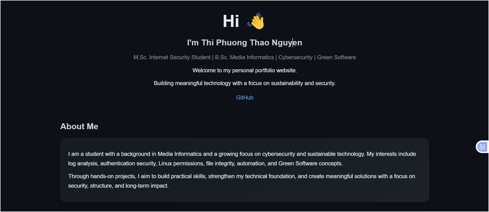

# 🌐 Thi Phuong Thao Nguyen – Portfolio

<h1 align="center">Hi 👋, I'm Thao Nguyen</h1>
<h3 align="center">Aspiring Cybersecurity Engineer | Media Informatics | Green Software</h3>

  

---

  
  
  
  

---

## 🔗 Live Website
👉 https://thiphuongthaonguyen-sec.github.io/

---

## 🖼️ Portfolio Preview

---

## 👩‍💻 About Me

I am a Media Informatics graduate and currently pursuing a Master's in Internet Security.

My focus is on building practical cybersecurity projects that explore:

- 🔐 Authentication & security fundamentals  
- 📊 Log analysis & anomaly detection  
- 🐧 Linux permissions & system security  
- 🛡️ File integrity monitoring  
- ⚙️ Automation & structured workflows  
- 🌱 Green Software & sustainability  

I aim to continuously improve my technical depth and build meaningful, real-world systems.

---

## 🚀 Projects

| Project | Description |
|--------|------------|
| 🔐 Auth Log Monitor | Detects suspicious login attempts and brute-force patterns |
| 🛡️ File Integrity Monitor | Identifies unauthorized file modifications |
| 🐧 Linux Permission Security | Hands-on Linux access control and permissions |
| 👥 Linux User Group Security | User/group management and system structure |
| 🔑 Password Security Basics | Hashing, vulnerabilities, best practices |
| 🔄 Secure Data Pipeline | Secure data validation and processing |
| 📊 Simple Log Analysis | Detects suspicious login behavior |
| 👀 Simple Log Monitor | Observes logs and highlights anomalies |
| 🐳 Docker Security Review | Basic container security concepts |
| 🚫 Fail2ban Style Project | Detect & react to suspicious login attempts |

---

## 🛠️ Tech Stack

  
  
  
  
  

---

## 📬 Contact

- 📧 Email: thaonguyen29041997@gmail.com  
- 💻 GitHub: https://github.com/thiphuongthaonguyen-sec  

---

✨ *This portfolio is continuously evolving as I grow in cybersecurity and software engineering.*

🤍 Bismillah – always learning, step by step.
